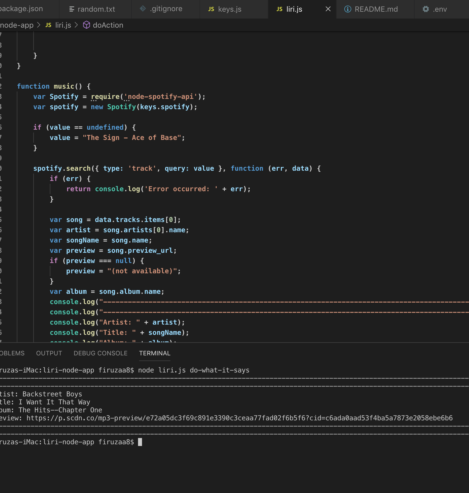

# liri-node-app
## Introduction/Description
The LIRI BOT app is designed to take user inputs(action, value) in the Terminal and complete an those requests in the terminal.

 _**The app is waiting for 2 particular user commands from the Terminal**_

1. First command **action** is chosen from a list of 4 defined actions
    1. concert-this
    1. spotify-this-song
    1. movie-this
    1. do-what-it-says
1. Second command **value** is defined by the user and represents corresponding to the **action** data.
    1. any band
    1. any song
    1. any movie
    1. any band, song, movie *as long as it is specified in the **random.txt** file*.
1. The result will vary for different **actions**.
    1. consert-this/any band will display:
        1. name of the venue
        1. venue location
        1. date of the event
        ```
        EXAMPLE: 
        Terminal command:  node liri.js concert-this "maroon 5"
                ---------------Event---------------
                Venue:       Doha Exhibition and Convention Center - DECC
                City:        Doha
                State:       
                Event Date:  12/18/2019
                -----------------------------------
                ---------------Event---------------
                Venue:       Mandalay Bay Events Center
                City:        Las Vegas
                State:       NV
                Event Date:  12/18/2019
                -----------------------------------
                ---------------Event---------------
                Venue:       Mandalay Bay Events Center
                City:        Las Vegas
                State:       NV
                Event Date:  12/18/2019
                -----------------------------------
        ```
    1. spotify-this-song/any song will display:
        1. artist
        1. the song's name
        1. a link from Spotify to the preview
        1. the name of the album


    ```
    EXAMPLE: 
    Terminal command: node liri.js spotify-this-song "jingle bells"
                --------------------------------------------------------------------------------------------------------------------------
                --------------------------------------------------------------------------------------------------------------------------
                Artist: Frank Sinatra
                Title: Jingle Bells
                Album: Ultimate Christmas
                Preview: (not available)
                --------------------------------------------------------------------------------------------------------------------------
                --------------------------------------------------------------------------------------------------------------------------
    ```
    1. movie-this/any movie will display:
        1. title of the movie.
        1. year the movie came out.
        1. IMDB Rating of the movie.
        1. Rotten Tomatoes Rating of the movie.
        1. country where the movie was produced.
        1. language of the movie.
        1. plot of the movie.
        1. actors in the movie.

```
    EXAMPLE: 
    Terminal command: node liri.js movie-this "matrix"
                --------------------------------------------------------------------------------------------------------------------------
                Title:                      Matrix
                Year:                       1993–
                IMDB Rating:                7.8
                Rotten Tomatoes Rating:     No Rating
                Origin Country:             Canada
                Language of the Movie:      English
                Movie Plot:                 Steven Matrix is one of the underworld's foremost hitmen until his luck runs out, and someone puts a contract out on him. Shot in the forehead by a .22 pistol, Matrix "dies" and finds ...
                Actors:                     Nick Mancuso, Phillip Jarrett, Carrie-Anne Moss, John Vernon
                --------------------------------------------------------------------------------------------------------------------------
 ```


1. do-what-it-says can display all of the above, as long as the **value** and the **action** are listed in the random.txt file.

    ```
    EXAMPLE: 
    Terminal command: node liri.js do-what-it-says
    _the **random.txt** file" had spotify-this-song,"I Want it That Way"_

                --------------------------------------------------------
                --------------------------------------------------------
                Artist: Backstreet Boys
                Title: I Want It That Way
                Album: The Hits--Chapter One
                Preview: https://p.scdn.co/mp3-preview/ e72a05dc3f69c891e3390c3ceaa77fad02f6b5f6?cid=c6ada0aad53f4ba5a7873e2058ebe6b6
                --------------------------------------------------------
                --------------------------------------------------------
            
                

    ```


https://github.com/firuzaa8/liri-node-app


## Technologies used:
node.js
axios
Apis
Spotify
OMDB
Bandsintown
moment.js
javascript


